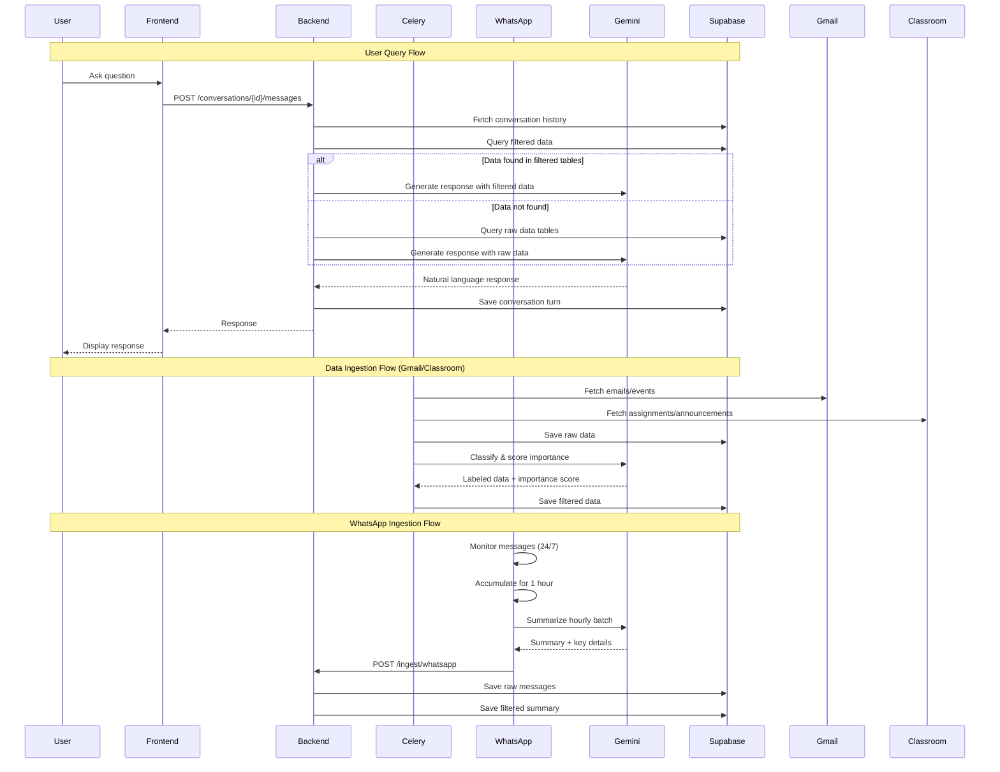
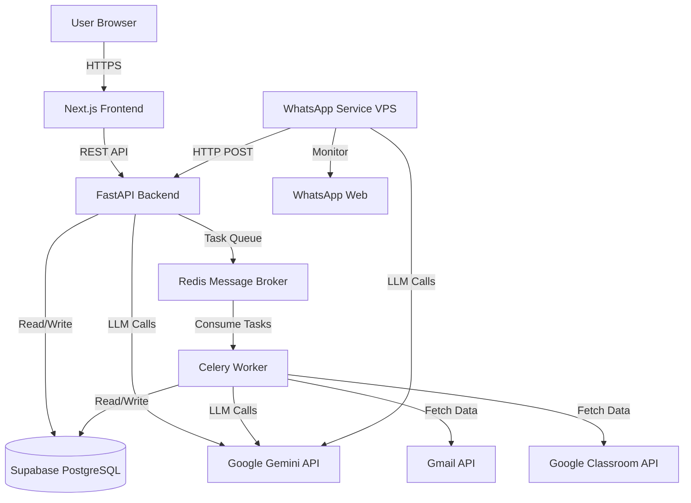

# Tech Plan: Personal Assistant Agent

## Architectural Approach

### Service Architecture

The system follows a **microservices architecture** with five core components:

1. **FastAPI Backend** - Central API server handling user queries, data ingestion coordination, and business logic
2. **Celery Worker** - Background task processor for scheduled data ingestion from Gmail and Google Classroom
3. **WhatsApp Service** - Standalone service running on VPS (OCI/Writer Cloud) for 24/7 WhatsApp monitoring
4. **Next.js Frontend** - Server-side rendered web application providing the chat interface
5. **Supabase (PostgreSQL)** - Centralized database for all data storage
6. **Redis** - Message broker for Celery task queue

### Key Architectural Decisions

**1. Dual-Data Storage Strategy**

All ingested data is stored in two forms:

- **Raw Data**: Unprocessed, original data from sources (safety net, fallback)
- **Filtered Data**: AI-processed, labeled, and scored data (optimized for queries)

**Rationale**: This approach optimizes query performance and reduces API costs by pre-processing data during ingestion, while maintaining raw data as a fallback when AI classification is uncertain or incomplete.

**2. Centralized Data Ingestion via Backend API**

The WhatsApp service communicates with the database exclusively through the FastAPI backend API, not directly to Supabase.

**Rationale**: Centralizes data validation, business logic, and importance scoring in one place. Simplifies security (only backend has database credentials) and enables consistent data processing across all sources.

**3. Background Job Processing with Celery**

Scheduled ingestion tasks (Gmail, Google Classroom) run as Celery background jobs, separate from the main API process.

**Rationale**: Prevents long-running ingestion tasks from blocking API requests. Enables retry logic, task monitoring, and horizontal scaling of workers independently from the API server.

**4. Importance Detection During Ingestion**

AI-based importance classification happens during data ingestion, not query time. Each item receives an importance score stored in the database.

**Rationale**: Reduces query latency and API costs. Classification happens once per item rather than on every query. Enables efficient filtering of important announcements without repeated AI calls.

**5. Multi-Conversation Thread Support**

Users can create multiple conversation threads (like ChatGPT), each with independent context and history.

**Rationale**: Allows users to maintain separate contexts for different topics (e.g., one thread for daily briefings, another for project-specific queries) without context pollution.

**6. OAuth Token Management**

One-time OAuth setup for Gmail and Google Classroom with refresh tokens stored securely in Supabase.

**Rationale**: Eliminates repeated authentication friction. Refresh tokens enable long-term access without user intervention, critical for automated hourly ingestion.

**7. Docker Compose Orchestration**

All services (except WhatsApp on VPS) deployed using Docker Compose for local/single-machine deployment.

**Rationale**: Simplifies MVP deployment while maintaining containerization benefits. Easy to migrate to Kubernetes later if needed. Sufficient for Phase 1 single-user requirements.

**8. WhatsApp Hourly Buffer Persistence (No Data Loss on Restart)**

The WhatsApp service persists the in-progress 1-hour message buffer to local disk on the VPS (e.g., SQLite or append-only files), and resumes processing after container restarts.

**Rationale**: In-memory buffering risks losing messages if the container crashes/restarts mid-hour. Persisting the buffer ensures continuous monitoring without gaps.

**9. Controlled WhatsApp Summarization Scope (Cost Management)**

Hourly WhatsApp summarization covers (regardless of WhatsApp read/unread state):

- **All private chats** (messages in the last hour)
- **Only a configured allowlist of groups** (messages in the last hour)

**Empty Allowlist Behavior:** If `whatsapp_group_allowlist` is empty or null, **no groups are summarized** (only private chats). This is the safe default to prevent unexpected costs.

Other group chats may be stored as raw hourly batches (optional) but are not summarized unless explicitly enabled.

Note: The `is_seen` flag in our database refers to whether the user has reviewed the item/summary inside this assistant app (not WhatsApp read receipts).

**Rationale**: Busy group chats can create high token usage. Allowlisting groups preserves “continuous monitoring” where it matters, while keeping Gemini cost bounded.

**10. Idempotent Ingestion Using Time Windows + Cursors**

All ingestion pipelines are idempotent. Each source maintains a cursor (last successful sync timestamp / external ID) and raw writes are deduplicated using a stable key.

**Rationale**: Hourly scheduled ingestion + on-demand refetch will otherwise create duplicates and inconsistent results.

**11. Raw Data Retention Policy (14 Days)**

Raw data tables retain data for **14 days**, while filtered/processed tables are retained longer-term (subject to storage constraints).

**Cleanup Behavior:** The daily cleanup task deletes raw rows older than 14 days. Filtered data survives with null FK references (see Foreign Key Cascade Strategy).

**Rationale**: Raw data is valuable for fallback and re-processing, but has higher storage and privacy cost.

**12. Urgent Notifications via Email (Phase 1)**


**13. Initial Sync Backfill Limit (30 Days)**

On first-time setup when no cursor exists in `sync_state`, ingestion tasks fetch only the **last 30 days** of data from each source.

**Rationale**: Prevents overwhelming initial sync (thousands of emails/assignments), reduces API costs, and provides reasonable historical context. Configurable via environment variable if user needs longer history.

**14. Self-Notification Loop Prevention**

Urgent notification emails sent via Gmail API are tagged with a custom header (`X-Assistant-Notification: true`) and filtered out during Gmail ingestion to prevent infinite loops.

**Rationale**: Without this, urgent emails would be re-ingested, potentially triggering more notifications.

For urgent/important items detected during ingestion, the system sends an email notification to the user.

MVP choice: Send email using the **Gmail API** from the user’s own account to the user’s email address (requires including send permission in the one-time OAuth setup).

**Rationale**: Email notifications provide MVP value without needing a push-notification system.

### Data Flow Architecture



### Technology Stack Summary


| Component            | Technology              | Rationale                                                 |
| -------------------- | ----------------------- | --------------------------------------------------------- |
| Backend API          | FastAPI (Python)        | Async support, automatic API docs, fast development       |
| Frontend             | Next.js (React)         | SSR for performance, React ecosystem, TypeScript support  |
| Database             | Supabase (PostgreSQL)   | Managed PostgreSQL, real-time capabilities, built-in auth |
| LLM                  | Google Gemini API       | Cost-effective, good performance, API simplicity          |
| Task Queue           | Celery + Redis          | Industry standard, reliable, supports scheduling          |
| WhatsApp Integration | whatsapp-web.js         | Unofficial but stable, no business account required       |
| Deployment           | Docker + Docker Compose | Containerization, portability, simple orchestration       |


---

## Data Model

### Core Principles

1. **Dual Storage**: Every data source has both raw and filtered tables
2. **Type Separation**: Separate tables for different data types (emails, events, assignments, messages)
3. **Common Metadata**: All tables share common fields (importance_score, is_seen, source, timestamps)
4. **Conversation Isolation**: Each conversation thread has independent history

### Database Schema

#### Raw Data Tables

**raw_emails**

```sql
id: UUID (PK)
user_id: UUID (FK to users)
gmail_message_id: String (unique)
subject: Text
body: Text
sender: String
recipients: String[]
received_at: Timestamp
labels: String[]
raw_metadata: JSONB
created_at: Timestamp
```

**raw_events**

```sql
id: UUID (PK)
user_id: UUID (FK to users)
google_event_id: String (unique)
title: Text
description: Text
start_time: Timestamp
end_time: Timestamp
location: String
attendees: String[]
raw_metadata: JSONB
created_at: Timestamp
```

**raw_assignments**

```sql
id: UUID (PK)
user_id: UUID (FK to users)
classroom_assignment_id: String (unique)
course_name: String
title: Text
description: Text
due_date: Timestamp
materials: JSONB
raw_metadata: JSONB
created_at: Timestamp
```

**raw_classroom_announcements**

```sql
id: UUID (PK)
user_id: UUID (FK to users)
classroom_announcement_id: String (unique)
course_name: String
title: Text
text: Text
announced_by: String
announced_at: Timestamp
raw_metadata: JSONB
created_at: Timestamp
```

**raw_messages**

```sql
id: UUID (PK)
user_id: UUID (FK to users)
chat_name: String
is_group: Boolean
sender: String
message_batch: JSONB (array of messages from 1-hour window)
batch_start_time: Timestamp
batch_end_time: Timestamp
created_at: Timestamp
```

#### Ingestion State & Deduplication

**sync_state**

```sql
id: UUID (PK)
user_id: UUID (FK to users)
source: String (gmail, classroom, whatsapp)
scope_key: String (e.g., "global", "chat:<chat_name>")
last_synced_at: Timestamp
last_external_id: String (nullable)
updated_at: Timestamp
```

Notes:

- For WhatsApp, `scope_key` is per chat (private chat or group).
- WhatsApp raw batches should be unique on `(user_id, chat_name, batch_start_time, batch_end_time)` to prevent duplicate hourly writes.
- For Gmail/Classroom, external IDs (messageId / courseworkId / announcementId) remain the preferred dedupe keys, with timestamps as a fallback.

#### Filtered/Processed Data Tables

**emails**

```sql
id: UUID (PK)
user_id: UUID (FK to users)
raw_email_id: UUID (FK to raw_emails)
subject: Text
summary: Text (AI-generated)
sender: String
importance_score: Float (0-1)
category: String (task, announcement, meeting, personal, spam)
extracted_deadline: Timestamp (nullable)
is_seen: Boolean
source: String ('gmail')
received_at: Timestamp
processed_at: Timestamp
```

**events**

```sql
id: UUID (PK)
user_id: UUID (FK to users)
raw_event_id: UUID (FK to raw_events)
title: Text
description: Text
start_time: Timestamp
end_time: Timestamp
location: String
importance_score: Float (0-1)
event_type: String (class, meeting, deadline, exam, social, personal)
is_seen: Boolean
source: String ('gmail_invite' | 'google_calendar')
processed_at: Timestamp
```

MVP note: Calendar integration can start by extracting meeting invites/events from Gmail content (e.g., invites), and only add direct Google Calendar API integration if it proves straightforward in Phase 1.

**assignments**

```sql
id: UUID (PK)
user_id: UUID (FK to users)
raw_assignment_id: UUID (FK to raw_assignments)
course_name: String
title: Text
description: Text
due_date: Timestamp
importance_score: Float (0-1)
status: String (pending, in_progress, completed)
is_seen: Boolean
source: String ('google_classroom')
processed_at: Timestamp
```

**announcements**

```sql
id: UUID (PK)
user_id: UUID (FK to users)
source_type: String (email, classroom, whatsapp)
source_id: UUID (FK to source table)
title: Text
content: Text
announced_by: String
importance_score: Float (0-1)
category: String (urgent, deadline, general, event)
is_seen: Boolean
announced_at: Timestamp
processed_at: Timestamp
```

**whatsapp_summaries**

```sql
id: UUID (PK)
user_id: UUID (FK to users)
raw_message_id: UUID (FK to raw_messages)
chat_name: String
is_group: Boolean
summary: Text (AI-generated)
key_points: String[] (extracted important items)
mentioned_deadlines: JSONB (array of {task, deadline})
importance_score: Float (0-1)
is_seen: Boolean
batch_start_time: Timestamp
batch_end_time: Timestamp
processed_at: Timestamp
```

#### Conversation & User Tables

**users**

```sql
id: UUID (PK)
clerk_id: String (unique, from Clerk Auth)
email: String (required)
username: String (optional, defaults to email prefix)
created_at: Timestamp
updated_at: Timestamp
```

**oauth_tokens**

```sql
id: UUID (PK)
user_id: UUID (FK to users)
provider: String ('google') -- single provider for Gmail, Calendar, and Classroom
access_token: String (encrypted)
refresh_token: String (encrypted)
expires_at: Timestamp
scopes: String[] (granted OAuth scopes)
created_at: Timestamp
updated_at: Timestamp
```

**conversations**

```sql
id: UUID (PK)
user_id: UUID (FK to users)
title: String (auto-generated or user-set)
created_at: Timestamp
updated_at: Timestamp
```

**conversation_messages**

```sql
id: UUID (PK)
conversation_id: UUID (FK to conversations)
role: String (user, assistant)
content: Text
created_at: Timestamp
```

**user_settings**

```sql
id: UUID (PK)
user_id: UUID (FK to users)
important_senders: String[] (email addresses/names)
keyword_rules: JSONB (importance keywords)
whatsapp_group_allowlist: JSONB ({"groups": [{id, name, added_at}]} — matched by stable group ID, not name)
notification_preferences: JSONB
created_at: Timestamp
updated_at: Timestamp
```

### Data Relationships

- Each user has multiple conversations (1:N)
- Each conversation has multiple messages (1:N)
- Each raw data entry has 0-1 filtered entry (1:0..1)
- Announcements reference source tables polymorphically via source_type + source_id
- OAuth tokens are per-user per-provider (user can have multiple providers)

### Foreign Key Cascade Strategy

**Raw → Filtered Table Foreign Keys:**
- All FK references from filtered tables to raw tables use `ON DELETE SET NULL`
- **Rationale:** Filtered data is the primary query target and should survive raw data cleanup (14-day retention). When raw data is deleted, filtered data remains with null `raw_*_id` reference, preserving the processed information while losing the audit trail.

**User → Data Foreign Keys:**
- All FK references to `users` table use `ON DELETE CASCADE`
- **Rationale:** When a user is deleted, all their data should be removed.

**Conversation → Messages Foreign Keys:**
- `conversation_messages.conversation_id` uses `ON DELETE CASCADE`
- **Rationale:** Deleting a conversation should delete all its messages.

---

## Component Architecture

### System Components Overview



### Component Responsibilities

#### 1. Next.js Frontend

**Responsibilities:**

- Render chat interface with conversation threads
- Handle user authentication via Clerk Auth (social login, email/password)
- Display conversation history
- Provide "Refetch Data" button for on-demand ingestion
- Show sync status indicators
- Support conversation thread creation/switching

**Key Interfaces:**

- Clerk Auth handles sign-in/sign-up (no custom auth endpoints)
- `GET /conversations` - List user's conversation threads
- `POST /conversations` - Create new conversation thread
- `GET /conversations/{id}/messages` - Fetch conversation history
- `POST /conversations/{id}/messages` - Send user message, receive AI response
- `POST /ingest/trigger` - Trigger on-demand data ingestion
- `GET /sync/status` - Get last sync time and status

**Note:** Frontend calls backend directly without `/api/` prefix. Next.js does not proxy these requests.

**State Management:**

- Current conversation thread
- Conversation history
- User authentication state
- Sync status

#### 2. FastAPI Backend

**Responsibilities:**

- Handle all API requests from frontend
- Coordinate data ingestion from all sources
- Implement conversational agent logic
- Query Supabase (filtered data → raw data fallback)
- Construct prompts for Gemini API
- Manage conversation context and history
- Implement importance scoring logic (AI + rules + sender)
- Handle OAuth token refresh
- Provide ingestion endpoints for WhatsApp service

**Key API Endpoints:**

*Authentication (Clerk Auth):*

- `GET /auth/me` - Get current user (verifies Clerk JWT)
- `POST /webhooks/clerk` - Sync user events from Clerk (create/update/delete)
- `GET /google/auth-url` - Generate Google OAuth URL for API access
- `GET /google/callback` - Handle Google OAuth callback

*Conversations:*

- `GET /conversations` - List conversations
- `POST /conversations` - Create conversation
- `GET /conversations/{id}/messages` - Get messages
- `POST /conversations/{id}/messages` - Send message (triggers AI response)
- `DELETE /conversations/{id}` - Delete conversation

*Data Ingestion:*

- `POST /ingest/trigger` - Trigger on-demand ingestion (queues Celery tasks)
- `POST /ingest/whatsapp` - Receive WhatsApp summaries (called by WhatsApp service, requires API key auth)
- `GET /ingest/status` - Get ingestion status

*Data Management:*

- `PATCH /announcements/{id}/seen` - Mark announcement as seen
- `GET /sync/status` - Get last sync timestamps

*WhatsApp Settings:*

- `GET /whatsapp/groups` - List available WhatsApp groups
- `GET /whatsapp/allowlist` - Get current group allowlist
- `POST /whatsapp/allowlist` - Update group allowlist
- `POST /whatsapp/group-update` - Handle group name changes (called by WhatsApp service)

**Integration Points:**

- Supabase client for database operations
- Gemini API client for LLM calls
- Celery client for task queuing
- OAuth2 clients for Gmail/Classroom

#### 3. Celery Worker

**Responsibilities:**

- Execute scheduled ingestion tasks (hourly)
- Fetch data from Gmail API (emails, calendar events)
- Fetch data from Google Classroom API (assignments, announcements)
- Save raw data to Supabase
- Call Gemini API for classification and importance scoring
- Save filtered data to Supabase
- Handle OAuth token refresh
- Implement retry logic for API failures

**Scheduled Tasks:**

- `ingest_gmail_data()` - Runs hourly, fetches emails (and optionally derives events from invites)
- `ingest_classroom_data()` - Runs hourly, fetches assignments and announcements
- `refresh_oauth_tokens()` - Runs daily, refreshes expiring tokens
- `cleanup_raw_data()` - Runs daily, deletes raw rows older than 14 days
- `send_urgent_notifications()` - Runs frequently (or inline during ingestion), sends email notifications for urgent items

**Task Flow:**

1. Fetch data from source API
2. Save to raw table
3. For each item:
  - Extract key information
  - Call Gemini for classification and importance scoring
  - Apply rule-based scoring (sender importance, keywords)
  - Combine AI + rule scores
4. Save to filtered table
5. Create announcement entries for high-importance items

**Error Handling:**

- Retry failed API calls (exponential backoff)
- Log errors to monitoring system
- Continue processing remaining items on partial failure

#### 4. WhatsApp Service (VPS)

**Responsibilities:**

- Run whatsapp-web.js 24/7 on VPS
- Monitor all incoming WhatsApp messages (personal + group)
- Accumulate messages in memory for 1-hour batches
- Every hour, summarize batch using Gemini API
- Send summary to FastAPI backend via HTTP POST
- Handle QR code authentication
- Maintain WhatsApp session persistence

**Implementation:**

- Node.js service (whatsapp-web.js requires Node)
- In-memory message buffer with hourly flush
- Gemini API client for summarization
- HTTP client to call FastAPI backend
- Session persistence to avoid re-authentication

**Hourly Summarization Process:**

1. Continuously collect all incoming messages 24/7
2. Persist the in-progress hourly buffer to local disk on the VPS (SQLite or append-only files)
3. At the top of each hour, select chats to summarize:
  - **All private chats** (for the last hour)
  - **Only configured allowlisted groups** (for the last hour)
4. For each selected chat:
  - Construct prompt with messages
  - Call Gemini to extract: summary, key points, deadlines, important announcements
  - Calculate importance score
5. Send to backend: `POST /ingest/whatsapp` (backend handles raw + filtered writes)

Payload example:

```json
{
  "chat_name": "Project Group",
  "is_group": true,
  "batch_start_time": "...",
  "batch_end_time": "...",
  "messages": [...],
  "summary": "...",
  "key_points": [...],
  "deadlines": [...],
  "importance_score": 0.8
}
```

**Failure Recovery:**

- If the container restarts mid-hour, resume from persisted hourly buffer
- If backend POST fails, retry with exponential backoff; keep unsent payloads persisted until acked
- If Gemini API fails, send raw batch to backend and mark for later re-processing
- Session monitoring and auto-restart on disconnect

#### 5. Redis Message Broker

**Responsibilities:**

- Queue Celery tasks
- Store task results
- Enable task scheduling and periodic tasks

**Configuration:**

- Default Redis configuration
- Persistence enabled for task durability
- Separate queues for different task priorities (if needed)

#### 6. Supabase (PostgreSQL)

**Responsibilities:**

- Store all application data (raw, filtered, conversations, users)
- Provide real-time capabilities (future: live sync notifications)
- Handle authentication (future: when migrating to Clerk)
- Enforce data integrity via foreign keys and constraints

**Access Patterns:**

- Backend: Full read/write access
- Celery Worker: Full read/write access
- Frontend: No direct access (all via Backend API)
- WhatsApp Service: No direct access (all via Backend API)

### Deployment Architecture

**Docker Compose Services:**

```yaml
services:
  backend:
    - FastAPI application
    - Exposes port 8000
    - Environment: SUPABASE_URL, SUPABASE_KEY, CLERK_SECRET_KEY, CLERK_WEBHOOK_SECRET, GEMINI_API_KEY, REDIS_URL, GOOGLE_CLIENT_ID, GOOGLE_CLIENT_SECRET, ENCRYPTION_KEY, WHATSAPP_API_KEY, FRONTEND_URL

  frontend:
    - Next.js application
    - Exposes port 3000
    - Environment: NEXT_PUBLIC_API_URL, NEXT_PUBLIC_CLERK_PUBLISHABLE_KEY
  
  celery-worker:
    - Celery worker process
    - Environment: SUPABASE_URL, SUPABASE_KEY, GEMINI_API_KEY, REDIS_URL, GOOGLE_CLIENT_ID, GOOGLE_CLIENT_SECRET, ENCRYPTION_KEY
  
  celery-beat:
    - Celery scheduler for periodic tasks
    - Environment: REDIS_URL
  
  redis:
    - Redis server
    - Exposes port 6379
    - Volume for persistence
```

**WhatsApp Service (Separate VPS):**

- Deployed independently on OCI/Writer Cloud VPS
- Docker container with Node.js + whatsapp-web.js
- Environment: BACKEND_API_URL, GEMINI_API_KEY, WHATSAPP_API_KEY
- Volume for hourly buffer persistence (SQLite / append-only files)
- Volume for WhatsApp session persistence

### Inter-Component Communication

**Frontend ↔ Backend:**

- Protocol: HTTPS REST API
- Format: JSON
- Authentication: Clerk JWT tokens (from Clerk Auth sign-in)

**Backend ↔ Celery:**

- Protocol: Redis message queue
- Format: Serialized Python objects
- Pattern: Task queue with result backend

**WhatsApp Service → Backend:**

- Protocol: HTTPS POST
- Format: JSON
- Authentication: API key (shared secret)

**Backend/Celery → Gemini:**

- Protocol: HTTPS REST API
- Format: JSON
- Authentication: API key

**Backend/Celery → Gmail/Classroom:**

- Protocol: HTTPS REST API
- Format: JSON
- Authentication: OAuth 2.0 (refresh tokens)

**All Components → Supabase:**

- Protocol: PostgreSQL wire protocol
- Authentication: Connection string with credentials

### Security Considerations

1. **Secrets Management:**
  - Database credentials in environment variables
  - OAuth tokens encrypted at rest in database
  - API keys (Gemini, WhatsApp service) in environment variables
  - No secrets in code or Docker images
2. **Authentication:**
  - Frontend → Backend: Clerk JWT tokens (verified via Clerk SDK)
  - WhatsApp Service → Backend: API key authentication (shared secret in headers)
  - Backend → Gmail/Classroom: OAuth 2.0 refresh tokens
3. **Network Security:**
  - All external communication over HTTPS
  - WhatsApp service authenticates to backend via API key
  - Database not exposed to public internet (Supabase handles this)
4. **Data Privacy:**
  - User data isolated by user_id foreign keys
  - No cross-user data leakage
  - OAuth tokens encrypted in database

&nbsp;
